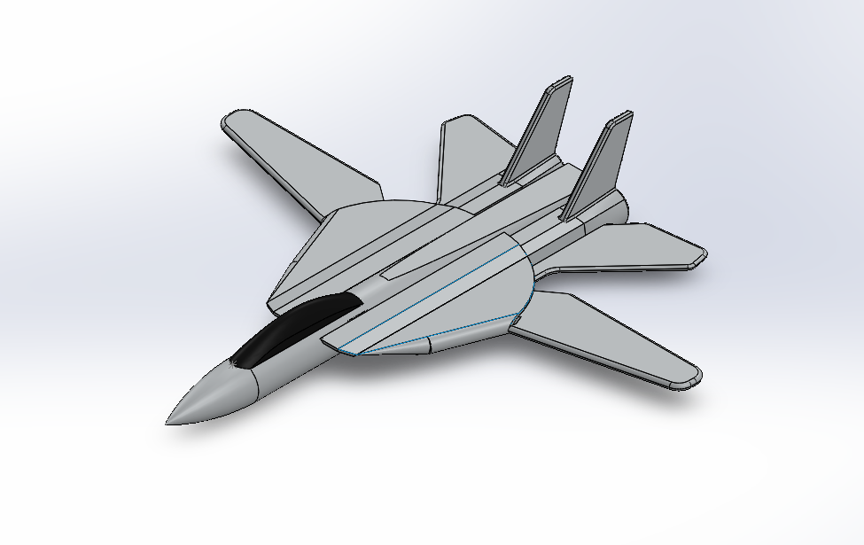
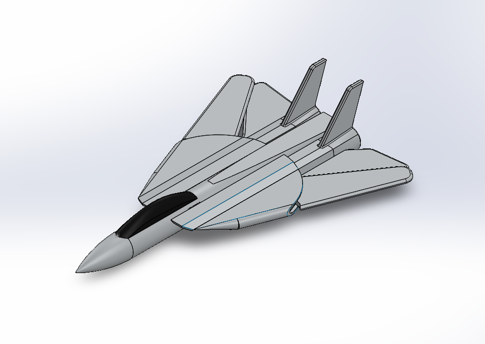

# F-14_Tomcat_Aircraft_Model

---

## Overview

A SolidWorks surface model of the **F-14 Tomcat**, a variable-sweep wing supersonic
fighter jet. The model was built entirely using surface modelling tools and solidified
into a final 3D body, focusing on accurately recreating the complex aerodynamic
geometry of the aircraft. A CFD analysis was also performed using SolidWorks Flow
Simulation for both wing configurations.

**Software:** SolidWorks 2025
**Type:** Personal Project

---

## Demo

[Watch Demo Video](Project_Demonstration.mp4)

---

## Model Details

The assembly consists of 3 parts:

| Part | Description |
|---|---|
| Central Body | Main fuselage including nose cone, cockpit, and tail section |
| Left Wing | Variable-sweep wing, foldable along the span axis |
| Right Wing | Variable-sweep wing, foldable along the span axis |

---

## Variable-Sweep Wing Mechanism

The F-14 Tomcat features variable-geometry wings that change position depending
on flight speed:

- **Low speed (takeoff/landing):** Wings spread outward for maximum lift
- **High speed:** Wings sweep back and fold in to reduce drag

This behaviour is replicated in the assembly using SolidWorks mates, allowing the
wings to rotate between the two positions.

---

## Surface Modelling Workflow

The entire model was constructed using SolidWorks surface tools before being
converted into a solid body:

- **Boundary Surface** — used to construct the fuselage and wing surfaces between
  complex profile curves
- **Swept Surface** — used for streamlined sections along defined paths
- **Filled Surface** — used to close open surface boundaries and gaps
- **Trim** — used to cut and clean up intersecting surfaces
- **Knit Surface** — used to merge all individual surfaces into a single closed body
- **Thicken** — used to convert the final knit surface into a solid 3D body

---

## CFD Analysis — SolidWorks Flow Simulation

Aerodynamic analysis was performed using SolidWorks Flow Simulation for both
wing configurations to study the effect of wing geometry on airflow behaviour.

### Results Obtained
- Surface pressure distribution (Pa) across the aircraft body
- Velocity streamlines and contour plots (m/s) around the aircraft
- Cut plots showing airflow behaviour in the cross-sectional plane

### Goals Tracked
- Maximum Total Pressure
- Average Velocity
- Drag Force (X-direction)
- Torque (X-axis)

### Key Observations
- The **unfolded wing** configuration shows a wider pressure distribution and
  larger wake region, suitable for low-speed flight
- The **folded wing** configuration produces a narrower, more streamlined wake,
  reducing drag at high speeds

---

## Files

| Folder/File | Contents |
|---|---|
| `CAD/` | SolidWorks part and assembly files (.SLDPRT, .SLDASM) |
| `CFD/` | Flow Simulation result plots (pressure, velocity, streamlines) |
| `Project_Demonstration.mp4` | Wing sweep demonstration video |
| `CAD/Wings_Open_Position.png` | SolidWorks render |
| `3D_Print_2.jpg` | Model photos |

---

## Skills Demonstrated

- Advanced surface modelling in SolidWorks
- Complex aerodynamic geometry construction
- Surface-to-solid conversion workflow
- Multi-body assembly with movable components
- CFD simulation and aerodynamic analysis using SolidWorks Flow Simulation
